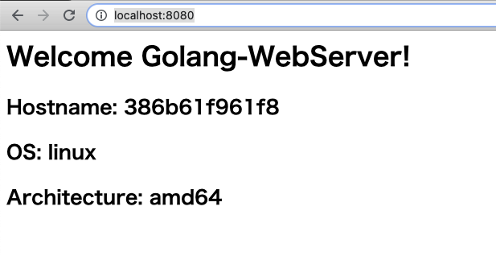

# Dockerの「マルチCPUアーキテクチャ」に対応したイメージをビルドする

[Dockerの「マルチCPUアーキテクチャ」に対応したイメージをビルドする | DevelopersIO](https://dev.classmethod.jp/articles/docker-multi-architecture-image-build/)

## 環境

Docker Desktop: 4.0.0(67817)

```
% sw_vers
ProductName: macOS
ProductVersion: 11.3.1
BuildVersion: 20E241
```

## 「実験的機能」の有効化


## デフォルトのビルダインスタンスを確認する

```sh
% docker buildx ls
docker buildx ls
NAME/NODE       DRIVER/ENDPOINT STATUS  PLATFORMS
desktop-linux   docker
  desktop-linux desktop-linux   running linux/amd64, linux/arm64, linux/riscv64, linux/ppc64le, linux/s390x, linux/386, linux/arm/v7, linux/arm/v6
default *       docker
  default       default         running linux/amd64, linux/arm64, linux/riscv64, linux/ppc64le, linux/s390x, linux/386, linux/arm/v7, linux/arm/v6
```


## 「Buildx」コマンドを使ったビルドを試してみる

```sh
% cd go-webserver-sample

% docker buildx build -t go-webserver-sample:latest --load .

% docker images
REPOSITORY                   TAG       IMAGE ID       CREATED          SIZE
go-webserver-sample          latest    45b655889253   55 seconds ago   11.7MB

%  docker run -d --rm -p 8080:8080 go-webserver-sample:latest

% open http://localhost:8080/
```


## 「マルチCPUアーキテクチャ」対応イメージをDocker Hubへ直接出力する

```sh
% docker login

% docker buildx build --platform linux/amd64,linux/arm64 -t oppara/go-webserver-sample:latest --push .
[+] Building 0.0s (0/0)
error: multiple platforms feature is currently not supported for docker driver. Please switch to a different driver (eg. "docker buildx create --use")
```

```sh
% docker buildx create --use
% docker buildx build --platform linux/amd64,linux/arm64 -t oppara/go-webserver-sample:latest --push .
```


```
% docker buildx ls
NAME/NODE           DRIVER/ENDPOINT             STATUS  PLATFORMS
nostalgic_diffie *  docker-container  
  nostalgic_diffie0 unix:///var/run/docker.sock running linux/amd64, linux/arm64, linux/riscv64, linux/ppc64le, linux/s390x, linux/386, linux/mips64le, linux/mips64, linux/arm/v7, linux/arm/v6
desktop-linux       docker  
  desktop-linux     desktop-linux               running linux/amd64, linux/arm64, linux/riscv64, linux/ppc64le, linux/s390x, linux/386, linux/arm/v7, linux/arm/v6
default             docker  
  default           default                     running linux/amd64, linux/arm64, linux/riscv64, linux/ppc64le, linux/s390x, linux/386, linux/arm/v7, linux/arm/v6
```

## gitlab ce に出力してみる

`try-buildx` というリポジトリを作っておく

```sh
% docker login gitlab.example.com:5002
% docker buildx create --use
% docker buildx build --platform linux/amd64 -t gitlab.example.com:5002/oppara/try-buildx/amd --push .
% docker buildx build --platform linux/arm64 -t gitlab.example.com:5002/oppara/try-buildx/arm --push .
```

[GitLab Container Registry - Qiita](https://qiita.com/masakura/items/802f4b8ce322d2543c80)


## WARNING 対応

`docker login` 時に以下の warning が発生

```
WARNING! Your password will be stored unencrypted in /Users/oppara/.docker/config.json.
Configure a credential helper to remove this warning. See
https://docs.docker.com/engine/reference/commandline/login/#credentials-store
```

```json:$HOME/.docker/config.json
{
  "credsStore": "osxkeychain"
}
```

## ログインしてるかどうか？

[ブログズミ: Docker login しているか確かめる方法](https://srz-zumix.blogspot.com/2020/11/docker-login.html)

```
% echo a | docker login
```
